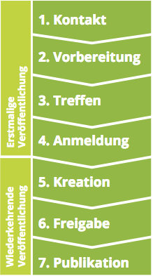
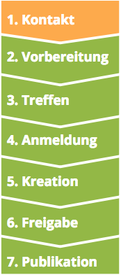

Anforderungen zur Veröffentlichung

- [Daten sind inventarisiert](/de/identify/inventory)
- [Daten erfüllen alle rechtlichen Bestimmungen](/de/prepare/frameworks)
- [Die Nutzungsbedingungen der Daten sind geklärt](/de/prepare/terms)
- [Das Hosting der Daten ist geklärt](/de/prepare/hosting)

# Die 7 Schritte zur Publikation

1. Kontakt Sobald Ihre Daten bereit sind – sprich alle Anforderungen für eine Veröffentlichung erfüllen, vereinbaren Sie einen Termin mit dem Bundesarchiv.
2. Vorbereitung Vor dem Meeting stellen Sie alle nötigen Unterlagen zusammen.
3. Treffen Im Meeting lernen Sie das Bundesarchiv kennen und klären alle offenen Themen.
4. Anmeldung Danach registrieren wir Ihre Organisation
und legen ein Konto für Sie an.
5. Kreation Nun können Sie Ihre Daten und Metadaten hochladen.
6. Freigabe Sind alle Informationen hochgeladen, prüfen
wir sie und geben sie frei.
7. Publikation Nach der Freigabe durch das Bundesarchiv können Sie die Daten Ihrer Organisation veröffentlichen.

# 1. Kontakt

**Einen Termin mit dem Bundesarchiv vereinbaren**

Die Publikation von Open Data ist komplex. Deshalb laden wir alle Organisationen, die zum ersten Mal Daten veröffentlichen zu einem Treffen mit uns ein. So lernen Sie uns kennen und wir können im Gespräch alle Fragen klären. Am besten schicken Sie uns eine Nachricht oder rufen uns an.

- Senden Sie uns eine Nachricht um ein Treffen zu vereinbaren
[Link zum Kontaktformular]
- Rufen Sie uns an 
[Link zur Kontaktseite]
